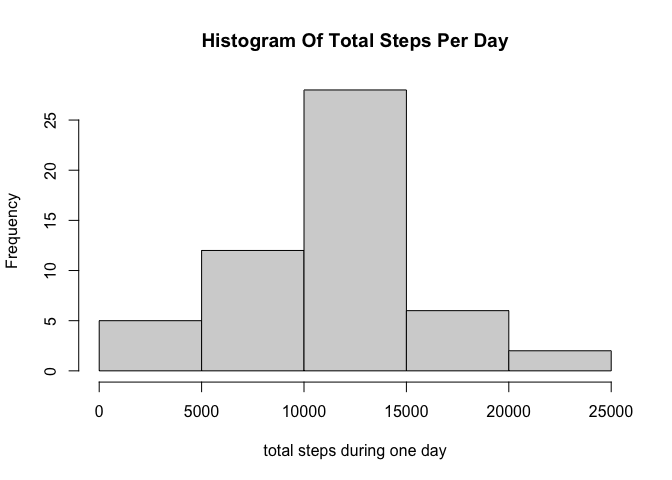
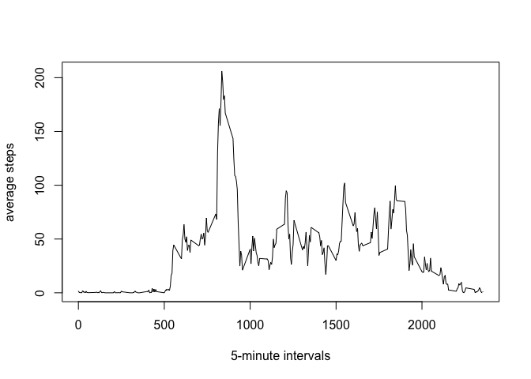
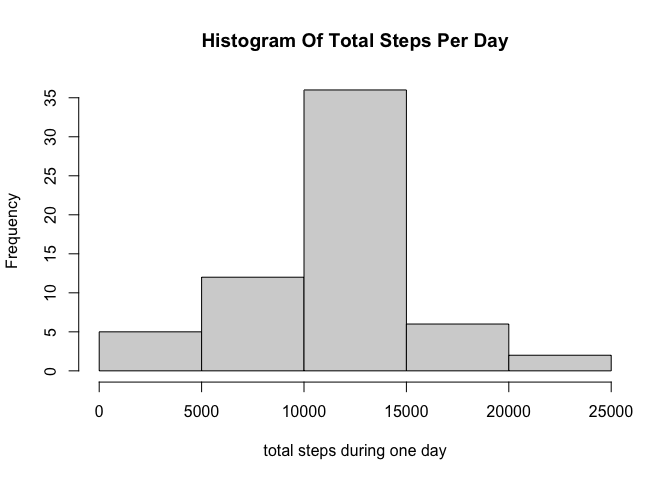
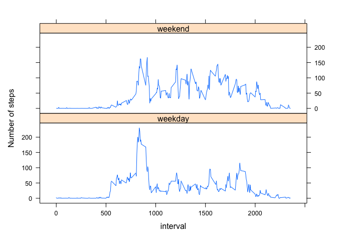

## Loading and preprocessing the data


```r
activity_data <- read.csv("./activity.csv")
activity_data[, "date"] <- as.Date(activity_data$date)
activity_data_no_na <- activity_data[ ( !is.na(activity_data$steps) ), ]
```

## What is mean total number of steps taken per day?

First we will show the frequincies of the total steps taken in a one day
period.


```r
tots <- tapply(activity_data_no_na$steps, 
               activity_data_no_na$date, 
               function(x) sum(x, na.rm = TRUE)
               )
hist(tots, xlab = "total steps during one day", main = "Histogram Of Total Steps Per Day")
```

<!-- -->

Now we will calculate the mean and median of the totals respectivly.


```r
mean(tots)
```

```
## [1] 10766.19
```

```r
median(tots)
```

```
## [1] 10765
```

## What is the average daily activity pattern?

Here we are calculating the average value for each 5 minute interval and
we will plot it onto a graph.


```r
averages <- tapply(activity_data_no_na$steps, 
               activity_data_no_na$interval, 
               function(x) mean(x, na.rm = TRUE)
               )

plot(names(averages), averages, 
     type = "l", xlab = "5-minute intervals", ylab = "average steps")
```

<!-- -->

We can see that the interval with the most steps is around 800 to be
sure lets calculate it below.


```r
names(averages)[which.max(averages)]
```

```
## [1] "835"
```

Man i was close! This interval is 8:35am seems like people like morning
runs.

## Imputing missing values

We have a few missing values in our dataset we can calculate the exact
amount:


```r
sum(is.na(activity_data$steps))
```

```
## [1] 2304
```

That is a decent amount of missing data lets see what we can do about
it.

So we will use the previously calculated means for each 5-minute
interval to subsitute a NA value of that interval time rounded to
nearest integer. \> NOTE: It is possible we are creating a bias here
that is hidden; ex: lets say \> we don't have values for a sunday and we
use interval values calculated \> mostly from workdays then did we just
overide the real weekend values??


```r
#TODO can i get away without a loop come back to this.
filled_activity <- activity_data
for ( i in 1:length(activity_data$steps) ) {
  if (is.na(activity_data$steps[i]) )
    filled_activity$steps[i] <- 
      round(averages[as.character(activity_data$interval[i])])
}
```

Lets see how we affected the mean and median by subsituting the NAs.


```r
tots <- tapply(filled_activity$steps, 
               filled_activity$date, 
               function(x) sum(x, na.rm = TRUE)
               )
hist(tots, xlab = "total steps during one day", main = "Histogram Of Total Steps Per Day")
```

<!-- -->

```r
mean(tots)
```

```
## [1] 10765.64
```

```r
median(tots)
```

```
## [1] 10762
```

As we can see the results don't really differ from the prior results.
The reason is left as an exercise to the reader. (are NA values missing
from entire days only?)

## Are there differences in activity patterns
between weekdays and weekends? Lastley lets see if we can tell whether
people are more active during the week or the weekends.


```r
library(lattice)
days = factor(c("weekday", "weekend"))
filled_activity[, "isWeekend"] <- days[
  # this index will be 1 if condition is FALSE (weekday) and 2 otherwise
  as.numeric(weekdays(filled_activity$date) %in% c("Saturday", "Sunday")) + 1
  ]

weekday_averages <- aggregate(filled_activity$steps, 
                           list(filled_activity$interval, filled_activity$isWeekend), 
                           mean
                           )
colnames(weekday_averages) <- c("interval", "isWeekend", "average_steps")
xyplot( average_steps ~ interval | isWeekend, 
        weekday_averages, 
        layout = c(1, 2), type = "l", 
        ylab = "Number of steps"
        )
```

<!-- -->

```r
#TODO
# why couldnt i write 
#xyplot( Mean ~ interval | days, weekday_averages, layout = c(1, 2), type = "l")
# it printed plot with both graphs in each section and i don't know why
```

As we can see during the week this person mostly runs in the morning. On
weekends however even though he is still more likely to go in the
morning, the average step per 5-minute interval is more level.
